# Architecture Lyte / Forma

Documentation complète de l'architecture applicative — authentification, features, appels, connecteurs, Firebase, billing Stripe et autorisations.

> **Téléchargement / export**
> - Ce fichier : `docs/ARCHITECTURE.md` (Markdown, versionné dans le repo)
> - Version HTML navigable : `docs/ARCHITECTURE.html` (ouvrir dans le navigateur → Imprimer → Enregistrer en PDF)
> - Diagrammes Mermaid : copier un bloc ` ```mermaid ` dans [mermaid.live](https://mermaid.live) pour exporter PNG/SVG

**Projet Firebase :** `forma-cad-dev`  
**Déploiement prod :** Vercel — SPA `/app`, API `/api/*` → FastAPI, landing `/`  
**Secrets :** Google Secret Manager (`forma-backend-env`, `forma-functions-env`, `forma-frontend-env`)

---

## Table des matières

1. [Vue d'ensemble](#1-vue-densemble)
2. [Parcours utilisateur](#2-parcours-utilisateur)
3. [Authentification](#3-authentification)
4. [Modèle Firestore](#4-modèle-firestore)
5. [Connecteurs OAuth](#5-connecteurs-oauth)
6. [Appels vocaux & Théâtre](#6-appels-vocaux--théâtre)
7. [Chat IA vs Messages](#7-chat-ia-vs-messages)
8. [Billing Stripe](#8-billing-stripe)
9. [Autorisations](#9-autorisations)
10. [Routes API](#10-routes-api)
11. [Référence fichiers](#11-référence-fichiers)

---

## 1. Vue d'ensemble

```mermaid
flowchart TB
  subgraph CLIENT["Frontend React (Vite)"]
    APP[App.tsx]
    AUTH_STORE[useAuthStore]
    WS_STORE[useWorkspacesStore]
    CALLS[useCallsStore]
    CHAT[useStore — AI Chat]
    PEOPLE[FriendsChatPanel — Messages]
    BILLING_UI[BillingSettings]
    CONNECTORS_UI[useConnectors]
  end

  subgraph FIREBASE["Firebase"]
    FB_AUTH[Firebase Auth]
    FS[(Firestore)]
    CF[Cloud Functions europe-west1]
    HOSTING[Hosting / Vercel SPA]
  end

  subgraph BACKEND["Backend FastAPI"]
    AUTH_DEP[auth_deps — verify ID token]
    CONNECTORS[/api/connectors]
    BILLING[/api/billing]
    HANDOFFS[/api/handoffs]
    CAL_SYNC[calendar_sync]
    CAD[/api — CAD local]
  end

  subgraph EXTERNAL["Services externes"]
    STRIPE[Stripe]
    GOOGLE[Google OAuth + Calendar + Gmail]
    MS[Microsoft OAuth + Outlook]
    SPOTIFY[Spotify OAuth]
    LLM[xAI / OpenAI / Anthropic]
  end

  APP --> AUTH_STORE
  AUTH_STORE --> FB_AUTH
  AUTH_STORE --> FS
  APP --> WS_STORE & CALLS & CHAT & PEOPLE
  CHAT --> CF
  CONNECTORS_UI --> CONNECTORS
  BILLING_UI --> BILLING
  PEOPLE --> FS
  CALLS --> FS

  CONNECTORS --> GOOGLE & MS & SPOTIFY
  CONNECTORS --> FS
  BILLING --> STRIPE
  BILLING --> FS
  CAL_SYNC --> GOOGLE & MS
  CF --> LLM
  CF --> FS
  AUTH_DEP --> FB_AUTH
  BACKEND --> AUTH_DEP
```

### Carte des composants

| Couche | Éléments clés |
|--------|---------------|
| **UI** | `AuthPage`, `ChatPanel`, `FriendsChatPanel`, `CallsView`, `TheaterView`, `PlanSettingsSection` |
| **Stores** | `useAuthStore`, `useWorkspacesStore`, `useCallsStore`, `useStore`, `usePeopleStore`, `useConnectorsStore` |
| **Firebase client** | `client.ts`, `userData.ts`, `friendChats.ts`, `webrtcSignaling.ts` |
| **Backend** | `main.py`, `connectors/`, `billing/`, `api/handoffs.py` |
| **Cloud Functions** | `aiChat`, `setUserApiKey`, `stripeWebhook`, `completeDesktopAuthSession` |
| **Externe** | Stripe, Google, Microsoft, Spotify, LLM providers |

---

## 2. Parcours utilisateur

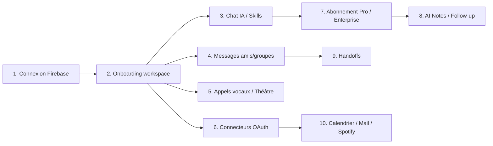

| # | Parcours | Fichiers principaux |
|---|----------|---------------------|
| 1 | Connexion OAuth ou magic link | `useAuthStore.ts`, `firebase/client.ts` |
| 2 | Création/jointure workspace | `useWorkspacesStore.ts`, `workspacesShared/` |
| 3 | Chat agent IA | `ChatPanel.tsx`, CF `aiChat` |
| 4 | Skills slash | `chatSkills.ts`, `mailSkill.ts`, `playSkill.ts` |
| 5 | Messages people | `FriendsChatPanel.tsx`, `friendChats/`, `groupChats/` |
| 6 | Appel vocal workspace | `useCallsStore.ts`, WebRTC signaling |
| 7 | Mode théâtre | `TheaterView.tsx`, `theaterChat/` |
| 8 | Calendrier sync | `calendarSync.ts`, `calendar_sync.py` |
| 9 | Connecteurs OAuth | `useConnectors.ts`, `connectors.py` |
| 10 | Abonnement Pro | `billingApi.ts`, Stripe webhooks |
| 11 | Enterprise workspace | `subscriptionPlans.ts`, checkout enterprise |
| 12 | Handoff | `useHandoffStore.ts`, `/api/handoffs` |
| 13 | Desktop Electron | `desktopAuthSessions/`, custom token |
| 14 | CAD (local only) | `/api/agent`, `/api/rebuild` |

---

## 3. Authentification

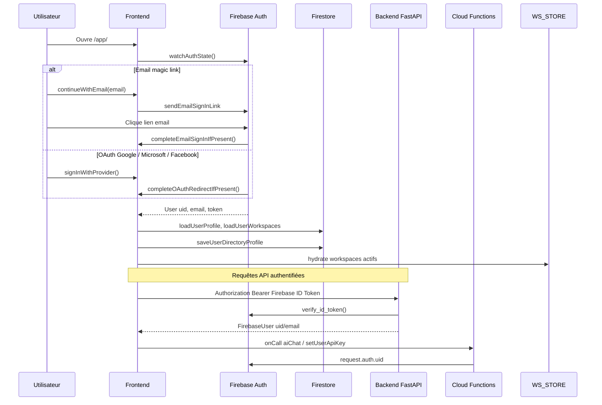

### Documents Firestore à l'auth

| Collection | Contenu |
|------------|---------|
| `users/{uid}` | profil, préférences, `subscriptionPlan`, `billingManaged` |
| `users/{uid}/private/apiKeys` | clés LLM BYOK (Functions/backend only) |
| `users/{uid}/private/connectors` | tokens OAuth (backend only) |
| `userDirectory/{uid}` | email, displayName pour @mentions |

### Auth desktop

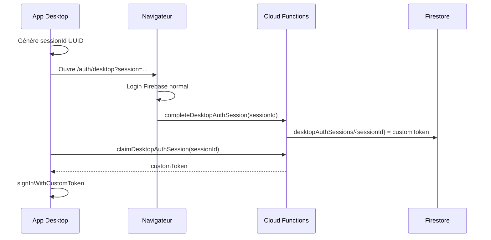

---

## 4. Modèle Firestore

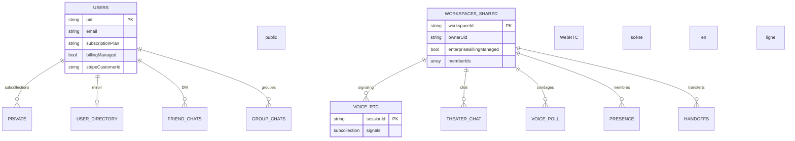

### Arborescence complète

```
users/{uid}                          # profil (owner read/write)
users/{uid}/workspaces/{id}
users/{uid}/memberships/{id}
users/{uid}/chatSessions/{id}
users/{uid}/projects/{id}            # CAD autosave
users/{uid}/friends/{friendUid}
users/{uid}/notifications/{id}
users/{uid}/private/billing          # Admin write only
users/{uid}/private/connectors         # Admin write only
users/{uid}/private/apiKeys/{provider}
users/{uid}/private/usage

userDirectory/{uid}
friendRequests/{id}
friendChats/{id}/messages/{msgId}
groupChats/{id}/messages/{msgId}
handoffs/{id}                        # create via Admin API

workspacesShared/{wid}
workspacesShared/{wid}/joinRequests/{uid}
workspacesShared/{wid}/members/{uid}
workspacesShared/{wid}/presence/{uid}
workspacesShared/{wid}/voiceKnocks/{id}
workspacesShared/{wid}/openVoiceChannels/{id}
workspacesShared/{wid}/voicePoll/active
workspacesShared/{wid}/theaterChat/{msgId}
workspacesShared/{wid}/voiceRtc/{sessionId}/signals/{signalId}
workspacesShared/{wid}/private/billing

desktopAuthSessions/{sessionId}
```

---

## 5. Connecteurs OAuth

### Registry

| ID | Provider | Scopes principaux | Skill |
|----|----------|-------------------|-------|
| `calendar` | Google | calendar.readonly, calendar.events | `/manage`, `/meeting` |
| `gmail` | Google | gmail.readonly, gmail.send | `/mail` |
| `outlook` | Microsoft | Mail.Read, Calendars.ReadWrite | calendrier Outlook |
| `spotify` | Spotify | streaming, playback | `/play` |

### Cycle OAuth complet

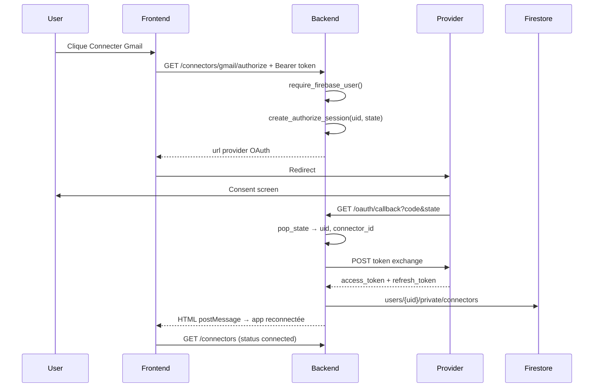

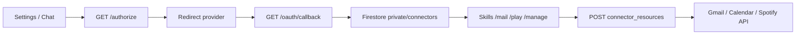

**Redirect URI prod :** `https://autocad-blue.vercel.app/api/connectors/oauth/callback`  
**Redirect URI dev :** `http://127.0.0.1:8000/api/connectors/oauth/callback`

### Exemple `/mail`

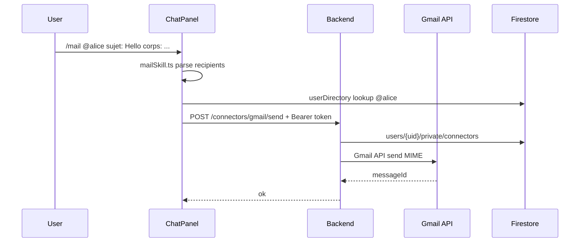

---

## 6. Appels vocaux & Théâtre

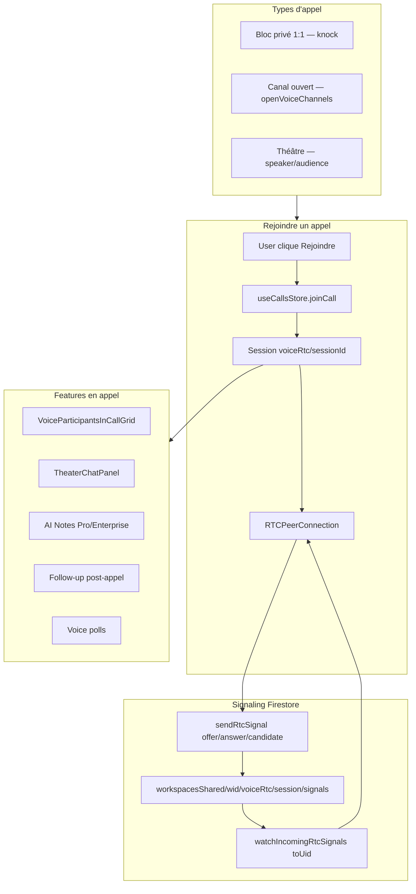

### Cycle WebRTC

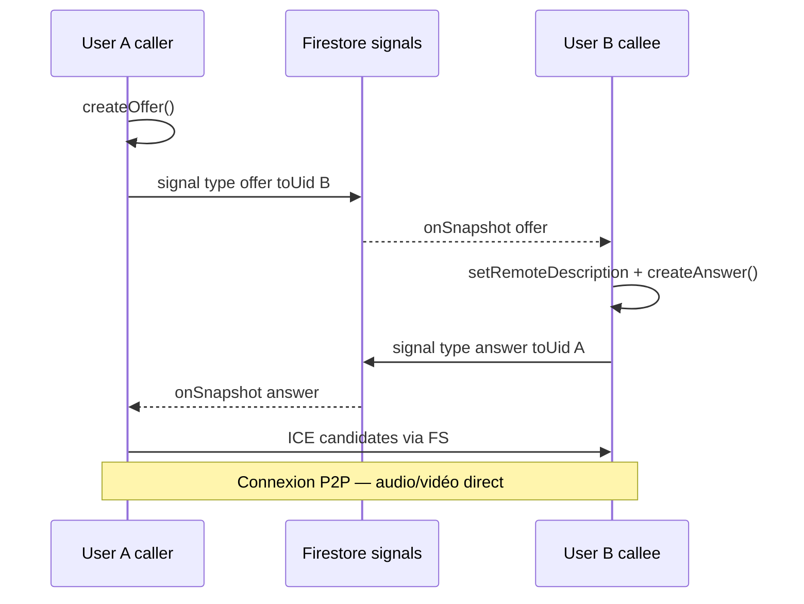

### Knock flow

1. Appelant : `sendVoiceKnock(workspaceId, fromUid, toUid)`
2. Destinataire : `JoinKnockOverlay` → accept/decline
3. Accept : `completeRemoteKnockJoin` → session RTC `private__{sorted_uids}`
4. Présence : `workspacesShared/{wid}/presence/{uid}` — `voiceInPrivateCall`, `voiceSpeaking`

---

## 7. Chat IA vs Messages

```mermaid
flowchart TB
  subgraph AI["Chat IA — ChatPanel"]
    AC1[useStore.sendChat]
    AC2[Skills slash]
    AC3{Type?}
    AC4[connectorSkills → Backend API]
    AC5[Cloud Function aiChat]
    AC6[LLM xAI/OpenAI/Anthropic]
    AC1 --> AC2 --> AC3
    AC3 -->|Connector| AC4
    AC3 -->|IA pure| AC5 --> AC6
  end

  subgraph PEOPLE["Messages — FriendsChatPanel"]
    PC1[friendChats / groupChats]
    PC2[/manage /group /handoff]
    PC3[Firestore temps réel]
    PC1 --> PC2 --> PC3
  end

  subgraph SHARED["Partagé"]
    M1[userDirectory @mentions]
    M2[handoffs + /api/handoffs]
    M3[workspacePolls]
  end

  AI --> SHARED
  PEOPLE --> SHARED
```

### Skills slash

| Skill | Fichier | Pro requis | Connecteur |
|-------|---------|------------|------------|
| `/manage` | `manageSchedulePrompt.ts` | Oui | Calendar |
| `/meeting` | `meetingSkill.ts` | Non | Calendar |
| `/mail` | `mailSkill.ts` | Non | Gmail |
| `/play` | `playSkill.ts` | Non | Spotify |
| `/group` | `createGroupSkill.ts` | Non | — |
| `/handoff` | `useHandoffStore.ts` | Si dest. non-Pro | — |
| `/recap` | `recapSkill.ts` | Oui | — |

---

## 8. Billing Stripe

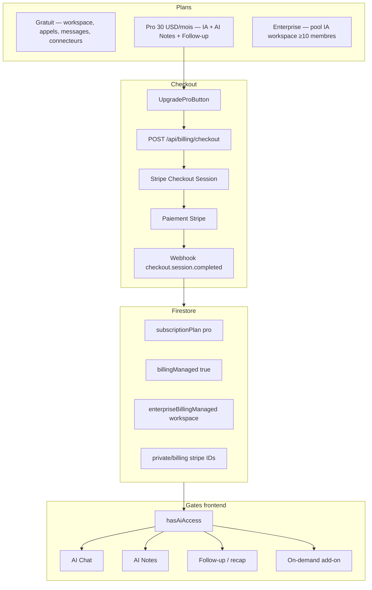

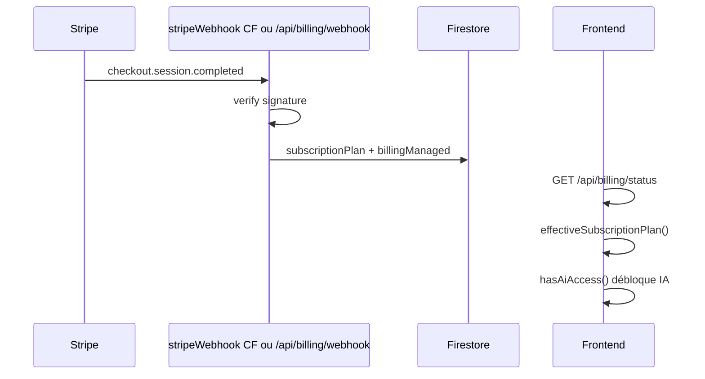

| Plan | Condition effective | Capacités |
|------|---------------------|-----------|
| **free** | défaut ou `billingManaged !== true` | Workspace, appels, messages, connecteurs |
| **pro** | `subscriptionPlan === "pro" && billingManaged` | IA, AI Notes, Follow-up, quota $30/mois |
| **enterprise** | workspace `enterpriseBillingManaged` | Pool IA partagé (≥10 membres) |

> **Règle critique :** `subscriptionPlan: "pro"` sans `billingManaged: true` = **free effectif**.

---

## 9. Autorisations

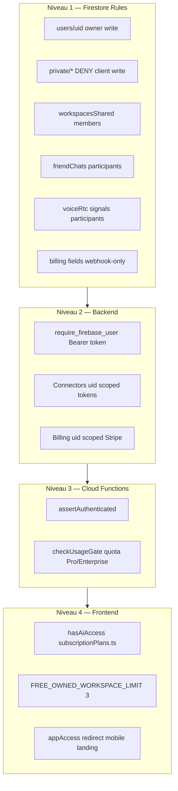

### Matrice d'accès

| Ressource | Client rules | Backend | Condition métier |
|-----------|-------------|---------|------------------|
| `users/{uid}` profil | owner | token verify | billing fields protégés |
| `users/{uid}/private/*` | deny write | Admin SDK | connectors, billing, usage |
| `workspacesShared/{wid}` | signed-in read | membership | enterprise webhook-only |
| `friendChats`, `groupChats` | participants | handoffs API | — |
| `handoffs/{id}` | read participants | create Admin only | Pro si dest. non-Pro |
| Connecteurs API | — | require_firebase_user | tokens server-side |
| IA chat | — | usage gate CF/backend | Pro ou Enterprise workspace |

---

## 10. Routes API

Base : `/api` (Vercel rewrite → FastAPI).

### Connecteurs

| Method | Route |
|--------|-------|
| GET | `/api/connectors` |
| GET | `/api/connectors/{id}/authorize` |
| GET | `/api/connectors/oauth/callback` |
| DELETE | `/api/connectors/{id}` |
| GET/POST | `/api/connectors/calendar/events` |
| GET/POST | `/api/connectors/gmail/send`, `/gmail/messages` |
| GET/POST | `/api/connectors/outlook/calendar/events` |
| GET/POST | `/api/connectors/spotify/play`, `/playback`, `/search` |

### Billing

| Method | Route |
|--------|-------|
| GET | `/api/billing/config`, `/status`, `/summary`, `/usage` |
| POST | `/api/billing/checkout/pro`, `/checkout/enterprise` |
| POST | `/api/billing/portal`, `/cancel`, `/sync` |
| POST | `/api/billing/on-demand/enable`, `/disable` |
| POST | `/api/billing/webhook` |

### Autres

| Method | Route |
|--------|-------|
| POST | `/api/handoffs` |
| POST/GET | `/api/auth/desktop/complete`, `/claim` |
| POST | `/api/chat`, `/api/recap` (full backend / local) |

### Cloud Functions (callable)

`aiChat`, `aiHealth`, `setUserApiKey`, `deleteUserApiKey`, `getUserApiKeyStatus`, `completeDesktopAuthSession`, `claimDesktopAuthSession`, `stripeWebhook`

---

## 11. Référence fichiers

| Domaine | Fichier |
|---------|---------|
| Règles Firestore | `firestore.rules` |
| Entry backend | `backend/app/main.py` |
| Registry connecteurs | `backend/app/connectors/registry.py` |
| OAuth flow | `backend/app/connectors/oauth.py`, `api/connectors.py` |
| Billing | `backend/app/api/billing.py`, `docs/STRIPE_BILLING.md` |
| Plans | `frontend/src/lib/subscriptionPlans.ts` |
| Auth store | `frontend/src/store/useAuthStore.ts` |
| Calls | `frontend/src/store/useCallsStore.ts` |
| WebRTC | `frontend/src/lib/webrtc/workspaceVoiceRtc.ts` |
| Skills | `frontend/src/lib/chatSkills.ts` |
| Cloud Functions | `functions/src/index.ts` |
| Connecteurs doc | `docs/CONNECTORS.md` |
| Déploiement | `vercel.json`, `firebase.json` |

---

## Carte mentale des features

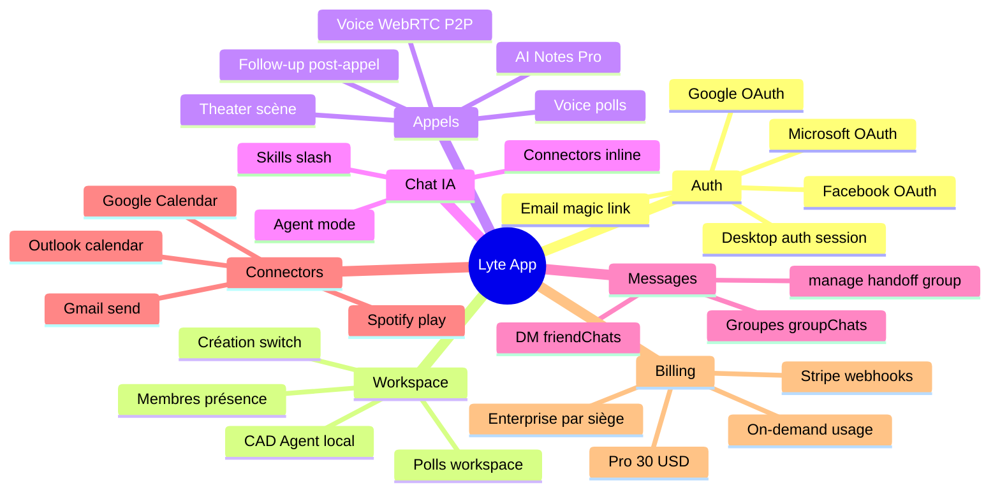
